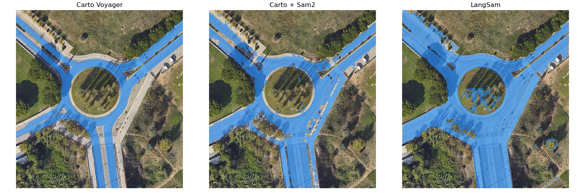

# SatelliteSegmentation

Tools for segmenting different elements such as trees and lane markers from satellite images.

It makes use of several open source libraries such as [sam2](https://github.com/facebookresearch/sam2/tree/main) and [samgeo](https://samgeo.gishub.org/).

Currently we support segmentation for
- Trees
- Roads
- Lane markers

## Examples

### Trees segmentation


### Roads segmentation



### Lane markers segmentation


## Prerequisites

[samgeo](https://samgeo.gishub.org/) makes use of [GDAL](https://gdal.org/en/stable/) for efficiently handling satellite images.

Install [GDAL](https://gdal.org/en/stable/)

```sh
 sudo apt install libgdal-dev
 ```

```sh
pip install --no-build-isolation --no-cache-dir --force-reinstall gdal 
```

If using conda:

```sh
conda install -c conda-forge gdal
```

```sh
conda install -c conda-forge localtileserver
```

## Local installation

To install the library, run:

```sh
pip install -e .
```

